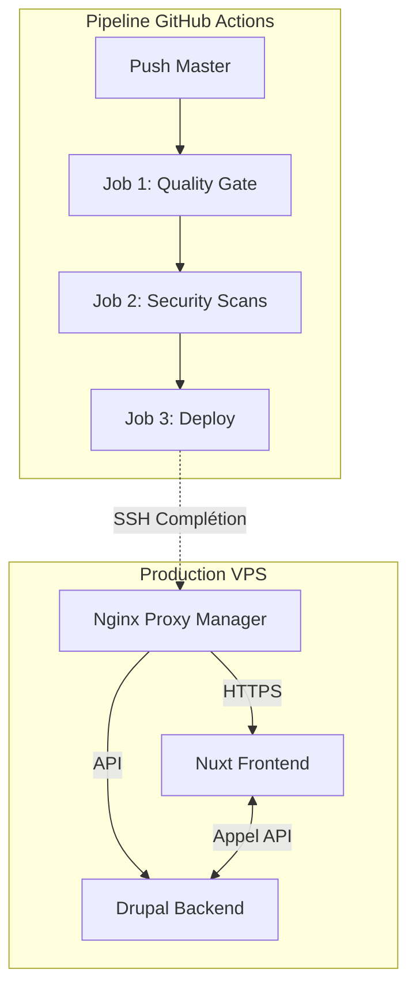

# MyDigitalStartup - Infrastructure DevSecOps

Ce dépôt contient l'application **Tholka** industrialisée. L'objectif de ce projet est de transformer un MVP en une application robuste, sécurisée et monitorée grâce à une chaîne CI/CD automatisée.

## Installation & Lancement Local

Pour un nouveau développeur, le lancement de la stack complète est automatisé via Docker.

### 1. Clonage du projet

```bash
git clone https://github.com/Thais-PH/tholka-devsecops
cd Tholka
```

### 2. Lancement des services

```bash
docker compose up -d --build
```

### 3. Accès

| Service | URL |
|---------|-----|
| **Frontend (Nuxt)** | http://localhost:3000 |
| **Backend (Drupal/PHP)** | http://localhost:8080 |

---

## Architecture & Choix Techniques

### Schéma du Pipeline CI/CD



#### Le Pipeline DevSecOps
Le pipeline est orchestré par **GitHub Actions** et suit strictement le flux de travail défini dans le fichier `ci.yml`, décomposé en 3 jobs principaux :

1. **Job 1 : Quality Gate (CI)**
   *C'est la première barrière. On vérifie que le code est sain avant d'aller plus loin.*
   - **Actions :** Installation des dépendances (NPM/Composer) et compilation (Build) du Frontend Nuxt et du Backend PHP.
   - **Objectif :** Garantir qu'aucune erreur de syntaxe ou de compilation ne bloque l'application.

2. **Job 2 : Security Scans (Sec)**
   *Ce bloc intègre la dimension Sec du DevSecOps en utilisant trois niveaux de protection :*
   - **SCA (Software Composition Analysis) :** Utilisation de `npm audit` et `composer audit` pour détecter des vulnérabilités dans les dépendances open-source.
   - **Secret Detection :** Utilisation de **Gitleaks** pour scanner l'historique des commits et s'assurer qu'aucun secret (clés API, mots de passe) n'a été publié.
   - **Container Scan :** Utilisation de **Trivy** pour scanner les images Docker construites. Cela permet d'identifier les vulnérabilités système (CVE) au sein même du conteneur.

3. **Job 3 : Deploy (CD)**
   *Le déploiement est automatisé et conditionné : il ne se déclenche que si les deux jobs précédents sont validés (au vert).*
   - **Méthode :** Connexion sécurisée via SSH sur le VPS Infomaniak.
   - **Action :** Mise à jour du dépôt local, synchronisation des variables d'environnement (`.env`) et redémarrage des services avec `docker compose up -d --build`.

### Pourquoi ce choix ?

* **Approche Fail-Fast :** En plaçant le Quality Gate en premier, on économise des ressources en arrêtant le pipeline immédiatement si le code est défectueux.
* **Défense en profondeur :** En combinant SCA, Secret Detection et Container Scan, on couvre toute la chaîne, du code source jusqu'à l'image finale.
* **Infrastructure as Code :** L'utilisation de `docker compose` garantit que l'environnement de production est identique à l'environnement de développement.

---

## Infrastructure de Production

* **Reverse Proxy :** Nginx Proxy Manager (NPM).
* **Sécurité :** Certificat SSL Let's Encrypt auto-géré.
* **Réseau :** Isolation des containers dans un réseau Docker dédié.

### Pourquoi ces outils ?

* **GitHub Actions :** Intégration native au dépôt, permettant un feedback immédiat aux développeurs.
* **Trivy :** Scanner de conteneurs leader du marché, capable de détecter des vulnérabilités OS (CVE) très précisément.
* **Nginx Proxy Manager :** Interface visuelle simplifiée pour gérer le HTTPS sans complexité manuelle de configuration Nginx.

---

## Procédure de "Rollback"

En cas d'échec critique lors d'une mise en production (site inaccessible, erreur 500 généralisée) :

### Via Git (Recommandé)

Utilisez la commande suivante pour revenir à la version stable précédente :

```bash
git revert HEAD --no-edit
git push origin master
```

Cela déclenchera automatiquement un nouveau pipeline de déploiement avec le dernier code fonctionnel connu.

### Via le VPS (Urgence)

Si le pipeline est bloqué, connectez-vous au VPS et relancez manuellement la dernière configuration stable :

```bash
cd /home/ubuntu/mon-projet
docker compose down
docker compose up -d
```

---

## Observabilité & Monitoring

Le suivi de l'état de santé de l'application est assuré par deux méthodes :

* **Logs :** Consultation en temps réel via `docker compose logs -f`.
* **Ressources :** Surveillance des métriques CPU/RAM et de la consommation des containers via la commande native `docker stats`.

---

## Démarche DevSecOps & Retours d'Expérience

### 1. Philosophie de la solution
Ma démarche a consisté à transformer un déploiement manuel et fragile en une chaîne de confiance automatisée. Le principe **"DevSecOps"** est ici appliqué par l'intégration de la sécurité au plus tôt (*Shift Left*) : la sécurité n'est pas une étape finale, mais une condition nécessaire au déploiement.

### 2. Sécurisation du Pipeline
Le pipeline a été sécurisé sur trois niveaux :
* **Intégrité du Code :** Aucun code n'est déployé s'il ne respecte pas les standards de build (Job Quality).
* **Protection des Secrets :** Utilisation des GitHub Secrets pour les clés SSH et les identifiants de base de données. Rien n'est écrit "en dur" dans le dépôt. L'ajout de Gitleaks garantit qu'aucune fuite accidentelle ne passe inaperçue.
* **Sécurité de l'Environnement :** Le scan d'image via Trivy assure que même si mon code est propre, le système qui l'héberge (Debian/Alpine) n'est pas porteur de failles connues.

### 3. Problèmes rencontrés & Résolutions
* **Conflits de ports sur le VPS :** Lors du passage à Nginx Proxy Manager (NPM), le port 80 était déjà utilisé par d'anciens containers. J'ai dû identifier les services en conflit, nettoyer l'environnement Docker et centraliser le routage sur NPM pour permettre le SSL.
* **Propagation DNS & Sous-domaines :** L'utilisation du domaine wildcard de l'école a nécessité des ajustements de configuration dans NPM (gestion des erreurs `NXDOMAIN` et `SSL_UNRECOGNIZED_NAME_ALERT`). J'ai résolu cela en simplifiant la hiérarchie des sous-domaines pour correspondre aux entrées DNS autorisées.
* **Communication Inter-Containers :** L'isolation réseau de Docker empêchait parfois le Frontend de joindre le Backend. J'ai stabilisé cela en utilisant le réseau interne de Docker-Compose et en exposant correctement les ports via le Reverse Proxy.

### 4. Conclusion
Cette mise en place garantit que chaque mise à jour de l'application Thais est testée, scannée et déployée de manière identique, réduisant ainsi le risque d'erreur humaine et augmentant la stabilité de la production.
